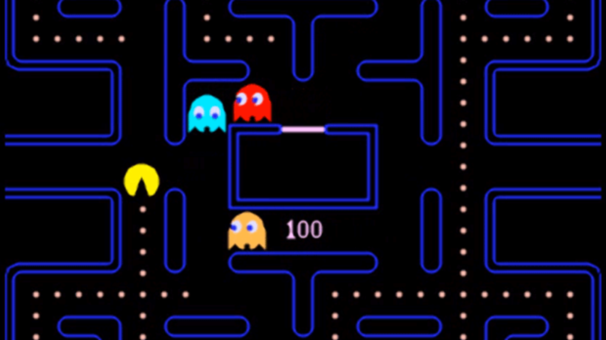
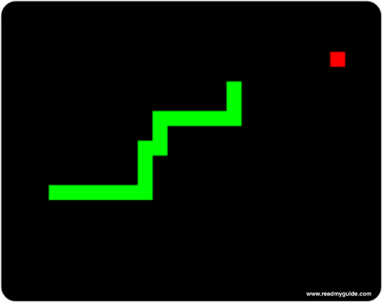

# Startdocument for Javascript
Startdocument of **Christopher Sulistiyo**. Studentnumber __4850025__
## Snake-Man game
The game will be made in Javascript combining 2 of the famous classic games, Pac-man and Fruit Snake game. The concept of the game is that there is a snake in a room, with walls created and located like Pacman map alike. The objective is to eat the apple, avoid the walls, avoid the ghost, and get the snake tail as long as possible to achieve a new highscore. There is no win or lose condition in the game. As you eat the apples, the game speed will increase and the snake body will get longer. Colliding the snake head or body into a wall or an enemy will result for a game over 

 
 

## Out of scope
- Ghost AI

## Library that is used and why
JQuery, because it is the most famous one, the programmer already have some knowledge for using it, and it is easy & fun

## Changes from the last proposal that the programmer sent
The game will be mostly displaying dots and not the pacman animation since it will make the game a lot easier to code and the game has more functionality of Snake Fruit to the Pacman game (80% : 20%) instead of vice versa

## What can be improve
- Random map as to increase the difficulity level
- Highscore (user login database for displaying the highscore)
- Add animation so the game will be leaning more towards Pacman
- Server hosting (Node.js)
